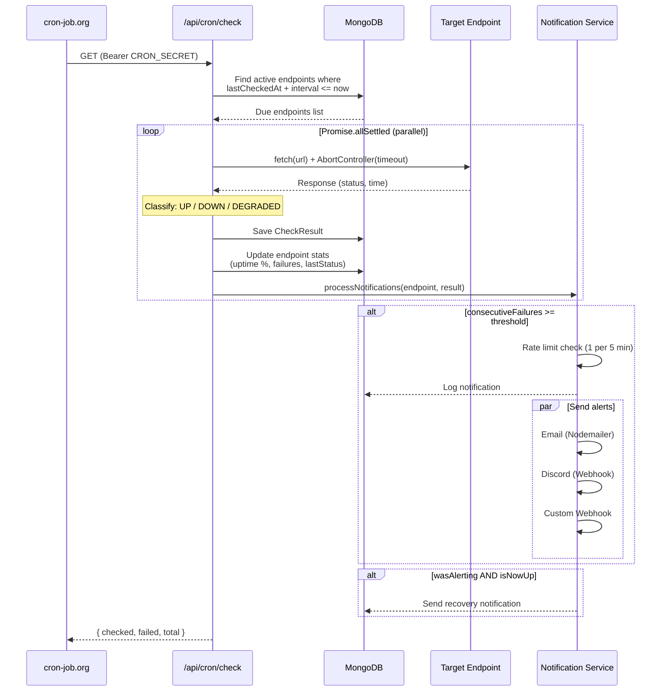
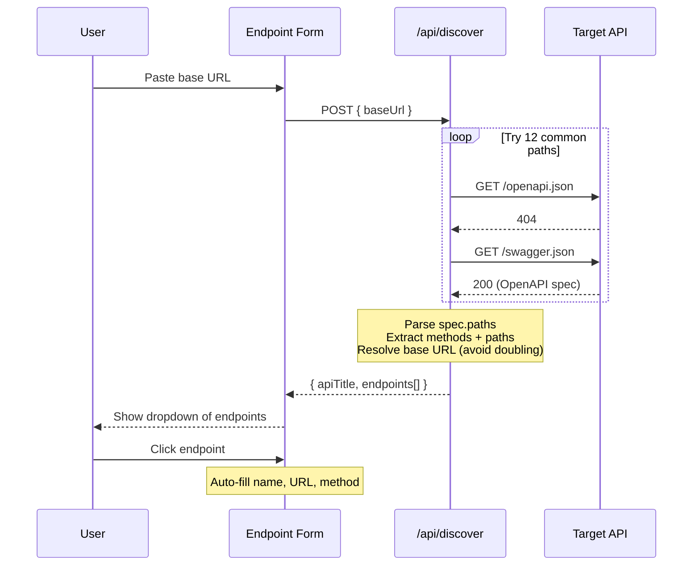
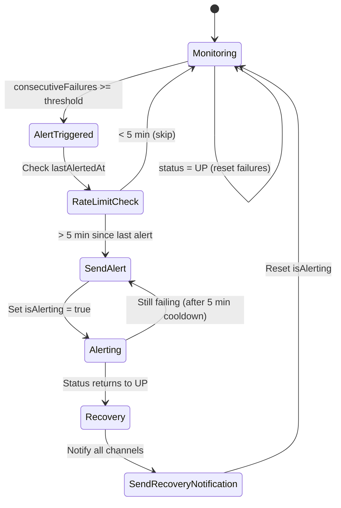

# Pulse — API Health Monitor

A real-time API health monitoring dashboard built with Next.js 14, deployed on Vercel's free tier. Monitor HTTP/HTTPS endpoints, get alerts when things go down, and visualize uptime with rich charts — all at **$0/month**.

## Features

- **Real-time monitoring** — Checks endpoints every minute via external cron + client-side AutoChecker
- **Live dashboard** — Auto-refreshing (10s) overview with stats cards, performance charts, status donut, uptime bars, and recent notifications
- **API Discovery** — Paste a base URL, auto-discover endpoints from OpenAPI/Swagger specs
- **Project grouping** — Organize endpoints by project with color-coded labels and dashboard filtering
- **Endpoint management** — Add, edit, pause/resume, delete endpoints with custom headers, body, method, interval, and timeout
- **Multi-channel alerts** — Email (SMTP), Discord (webhook), and custom webhook notifications with rate limiting and recovery alerts
- **Role-based auth** — Admin and viewer roles with NextAuth.js v5, JWT sessions, 3-layer auth protection
- **AI analytics** — LLM-powered health analysis with scoring, insights, and recommendations (Ollama/OpenAI-compatible)
- **Data export** — CSV export + real PDF reports (jsPDF) for endpoints and dashboard summary
- **Dark mode** — Toggle between warm orange/amber (light) and cool blue/teal (dark) themes
- **Pixel art mascot** — Cute dino that walks around the dashboard, reacts to endpoint status with speech bubbles and sound effects

---

## Architecture

### System Overview

```mermaid
graph TB
    subgraph Browser["Browser (Client)"]
        UI[Next.js App Router]
        SWR[SWR Polling<br/>every 10s]
        AC[AutoChecker<br/>every 60s]
        Guard[SessionGuard]
        Dino[Dino Mascot]
    end

    subgraph Vercel["Vercel (Serverless)"]
        API[API Routes<br/>/api/*]
        MW[Middleware<br/>Auth Protection]
        Cron[/api/cron/check]
        Trigger[/api/cron/trigger]
        Discover[/api/discover]
        Analytics[/api/analytics]
    end

    subgraph External["External Services"]
        Mongo[(MongoDB Atlas<br/>Free M0)]
        CronJob[cron-job.org<br/>Every 1 min]
        LLM[Ollama LLM<br/>Self-hosted]
    end

    subgraph Notifications["Notification Channels"]
        Email[Email<br/>Nodemailer SMTP]
        Discord[Discord<br/>Webhook]
        Webhook[Custom<br/>Webhook]
    end

    UI --> SWR
    SWR -->|GET /api/*| API
    AC -->|POST /api/cron/trigger| Trigger
    Guard -->|checks session| MW

    CronJob -->|GET + Bearer token| Cron
    Cron --> Mongo
    Trigger --> Mongo
    API --> Mongo
    Discover -->|fetches OpenAPI specs| External
    Analytics -->|/api/chat| LLM

    Cron --> Email
    Cron --> Discord
    Cron --> Webhook
    Trigger --> Email
    Trigger --> Discord
    Trigger --> Webhook
```

### Health Check Flow



### Authentication Flow (3-Layer Protection)

```mermaid
flowchart TD
    A[Request] --> B{Layer 1:<br/>Middleware}
    B -->|No session| Z[Redirect /login]
    B -->|Valid session| C{Layer 2:<br/>Server Layout}
    C -->|auth() fails| Z
    C -->|auth() passes| D{Layer 3:<br/>SessionGuard}
    D -->|Session expired| Z
    D -->|Valid| E[Dashboard Rendered]

    F[API Request] --> G{Middleware<br/>Route Match?}
    G -->|Public route| H[Allow<br/>/api/health, /api/auth/*]
    G -->|Protected| I{Valid JWT?}
    I -->|No| J[401 Unauthorized]
    I -->|Yes| K{requireAdmin?}
    K -->|Viewer on write route| J
    K -->|Authorized| L[Execute Handler]
```

### Data Flow — Project Filtering

```mermaid
flowchart LR
    A[ProjectFilterBar<br/>Tab Pills] -->|setProjectId| B[ProjectFilterContext]
    B -->|projectId| C[useFilteredKey Hook]
    C -->|appends ?projectId=X| D[SWR Key]

    D --> E[/api/endpoints?projectId=X]
    D --> F[/api/stats?projectId=X]

    E --> G[EndpointGrid]
    F --> H[StatsCards]

    style B fill:#f0a830,color:#1a1a1a
```

### API Discovery Flow



### Notification State Machine



---

## Tech Stack

| Layer | Technology |
|-------|-----------|
| Framework | Next.js 14 (App Router, TypeScript) |
| Styling | Tailwind CSS 3 + custom design system |
| Database | MongoDB Atlas (free M0) + Mongoose 9 |
| Auth | NextAuth.js v5 (credentials + bcryptjs) |
| Data Fetching | SWR (10s global polling) |
| Charts | Recharts 3 |
| Theming | next-themes (class-based light/dark) |
| Scheduling | External cron (cron-job.org) + client-side AutoChecker |
| Notifications | Nodemailer (email) + fetch (Discord/webhook) |
| Export | csv-stringify (CSV) + jsPDF (PDF) |
| Validation | Zod 4 |
| AI | Ollama-compatible LLM API (configurable model) |

---

## Quick Start

```bash
# 1. Clone and install
git clone <repo-url>
cd pulse
npm install

# 2. Configure environment
cp .env.example .env.local
# Fill in MONGODB_URI and AUTH_SECRET at minimum

# 3. Run dev server
npm run dev
```

Open http://localhost:3000 — the first user to register automatically becomes admin.

---

## Environment Variables

| Variable | Required | Description |
|----------|----------|-------------|
| `MONGODB_URI` | Yes | MongoDB Atlas connection string |
| `AUTH_SECRET` | Yes | NextAuth.js secret (`openssl rand -base64 32`) |
| `CRON_SECRET` | Yes (prod) | Bearer token for cron endpoint auth |
| `LLM_URL` | No | Ollama-compatible API base URL (e.g. `https://your-ollama.com`) |
| `LLM_KEY` | No | API key for LLM service |
| `LLM_MODEL` | No | Model name (default: `qwen2.5:3b`) |
| `SMTP_HOST` | No | SMTP server for email notifications |
| `SMTP_PORT` | No | SMTP port (default: 587) |
| `SMTP_USER` | No | SMTP username |
| `SMTP_PASS` | No | SMTP password |
| `SMTP_FROM` | No | Sender email address |
| `DISCORD_WEBHOOK_URL` | No | Default Discord webhook URL |
| `DATA_RETENTION_DAYS` | No | Check history TTL (default: 30 days) |

---

## Deploy to Vercel

```bash
# Using Vercel CLI
npm i -g vercel
vercel login
vercel --prod --yes

# Add env vars
vercel env add MONGODB_URI production --value "your-uri"
vercel env add AUTH_SECRET production --value "your-secret"
vercel env add CRON_SECRET production --value "your-cron-secret"
```

Or: Push to GitHub → Import in Vercel → Add environment variables → Deploy.

### External Cron Setup (for 24/7 monitoring)

Vercel free tier limits cron to daily. Use [cron-job.org](https://cron-job.org) (free):

1. Create account at cron-job.org
2. New cron job:
   - **URL:** `https://your-app.vercel.app/api/cron/check`
   - **Schedule:** Every 1 minute
   - **Header:** `Authorization: Bearer YOUR_CRON_SECRET`

---

## Project Structure

```
src/
├── app/                        # Next.js App Router
│   ├── api/
│   │   ├── analytics/          # AI-powered health analysis
│   │   ├── auth/               # NextAuth handlers + register
│   │   ├── cron/               # check (cron) + trigger (manual)
│   │   ├── discover/           # OpenAPI spec discovery
│   │   ├── endpoints/          # Endpoint CRUD + history
│   │   ├── export/             # CSV + PDF export
│   │   ├── health/             # Public health check
│   │   ├── notifications/      # Notification log
│   │   ├── projects/           # Project CRUD
│   │   ├── stats/              # Aggregate dashboard stats
│   │   └── users/              # User management
│   ├── dashboard/              # Dashboard pages
│   │   ├── analytics/          # AI analytics page
│   │   ├── endpoints/          # Endpoint detail, new, edit
│   │   ├── notifications/      # Notification log page
│   │   ├── projects/           # Project management page
│   │   └── users/              # User management page
│   └── login/                  # Login page
├── components/
│   ├── auto-checker.tsx        # Client-side health check trigger
│   ├── dino-mascot.tsx         # Pixel art mascot with animations
│   ├── endpoint-card.tsx       # Endpoint card with status badge
│   ├── endpoint-form.tsx       # Create/edit form with API discovery
│   ├── nav-sidebar.tsx         # Dark sidebar navigation
│   ├── project-context.tsx     # Project filter React context
│   ├── providers.tsx           # SWR + Session + Theme providers
│   ├── session-guard.tsx       # Client-side auth guard
│   ├── stats-cards.tsx         # Gradient stat cards
│   ├── status-badge.tsx        # Pulsing status indicator
│   └── ...                     # Charts, widgets, forms
├── lib/
│   ├── models/                 # Mongoose schemas
│   │   ├── endpoint.ts         # Endpoint config + stats
│   │   ├── check-result.ts     # Check results (TTL 30 days)
│   │   ├── notification.ts     # Notification log
│   │   ├── project.ts          # Project grouping
│   │   └── user.ts             # User with roles
│   ├── services/
│   │   ├── check-endpoint.ts   # Health check engine (fetch + classify)
│   │   ├── notification.ts     # Alert state machine + multi-channel send
│   │   └── export.ts           # CSV/PDF generation
│   ├── hooks/
│   │   └── use-filtered-key.ts # Appends projectId to SWR URLs
│   ├── helpers/
│   │   ├── api-response.ts     # Standardized JSON responses
│   │   └── auth-guard.ts       # requireAuth / requireAdmin
│   ├── validators/             # Zod input schemas
│   ├── mongodb.ts              # Connection singleton
│   └── auth-options.ts         # NextAuth v5 config
├── middleware.ts                # Route protection
└── types/                      # TypeScript types + NextAuth augmentation
```

---

## Key Technical Decisions

| Decision | Rationale |
|----------|-----------|
| SWR polling over WebSocket | Simpler, works with serverless, 10s is fast enough for monitoring |
| Dual check triggers (cron + client) | Vercel free tier limits cron to daily; client AutoChecker fills the gap |
| JWT over database sessions | Stateless, no extra DB queries per request, works across serverless instances |
| MongoDB TTL index | Auto-cleans check history after 30 days — zero maintenance |
| Ollama over OpenAI/Anthropic | Self-hosted, $0 cost, no API rate limits, data stays internal |
| jsPDF over @react-pdf/renderer | Works in serverless (no browser/canvas needed), lightweight |
| CSS box-shadow pixel art | Zero image files, theme-reactive, tiny bundle size |

---

## Cost

| Service | Cost |
|---------|------|
| Vercel (hosting) | Free |
| MongoDB Atlas (database) | Free (M0 cluster) |
| cron-job.org (scheduler) | Free |
| Ollama LLM (AI analytics) | Self-hosted |
| **Total** | **$0/month** |

---

## Commands

```bash
npm run dev      # Development server (localhost:3000)
npm run build    # Production build
npm run lint     # ESLint
```

---

## API Reference

| Endpoint | Method | Auth | Description |
|----------|--------|------|-------------|
| `/api/health` | GET | Public | Health check |
| `/api/auth/[...nextauth]` | GET/POST | Public | NextAuth handler |
| `/api/auth/register` | POST | Admin* | Create user (*first user = auto-admin) |
| `/api/auth/me` | GET | Auth | Current user profile |
| `/api/endpoints` | GET | Auth | List endpoints (supports `?projectId=`) |
| `/api/endpoints` | POST | Admin | Create endpoint + immediate first check |
| `/api/endpoints/[id]` | GET/PUT/DELETE | Auth/Admin | Single endpoint CRUD |
| `/api/endpoints/[id]/history` | GET | Auth | Check results (limit=100) |
| `/api/stats` | GET | Auth | Aggregate stats (supports `?projectId=`) |
| `/api/projects` | GET/POST | Auth/Admin | Project CRUD |
| `/api/projects/[id]` | GET/PUT/DELETE | Auth/Admin | Single project CRUD |
| `/api/notifications` | GET | Auth | Recent notification log |
| `/api/users` | GET | Admin | List users |
| `/api/users/[id]` | PUT/DELETE | Admin | Update role / delete user |
| `/api/cron/check` | GET | CRON_SECRET | Scheduled health checks |
| `/api/cron/trigger` | POST | Admin | Manual check trigger |
| `/api/discover` | POST | Auth | OpenAPI spec discovery |
| `/api/analytics` | GET | Auth | AI health analysis |
| `/api/export/endpoints/[id]/csv` | GET | Auth | CSV export |
| `/api/export/endpoints/[id]/pdf` | GET | Auth | PDF endpoint report |
| `/api/export/dashboard/pdf` | GET | Auth | PDF dashboard summary |
